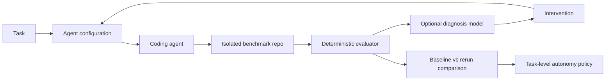

# Shadowline

Shadowline evaluates and improves coding-agent workflows, then uses evidence to recommend how much human oversight a class of engineering work needs.

## Problem

Coding agents increase implementation throughput, but uniform review requirements leave engineers inspecting every change with the same intensity. Teams need to understand failure causes, improve task inputs, and determine where autonomy is earned.

## Run locally

Node.js 22 or newer and npm are required. Fixture views and known-patch verification need no API key. Real agent execution currently requires macOS with working `sandbox-exec` and a Gemini Developer API key.

```sh
npm ci
npm run benchmark:setup
npm run dev
```

Open http://localhost:3000/verification to execute baseline readiness or either pagination patch. The dashboard and existing run/experiment pages retain their fixture data. Verification controls are available only with `npm run dev` and are disabled in production.

```sh
npm run typecheck
npm run lint
npm test
npm run benchmark:verify
npm run build
npm start
```

Browser checks (first install Chromium):

```sh
npx playwright install chromium
npm run test:e2e
```

The browser suite starts production on port 3100 and development on port 3101. It expects a completed build and installed benchmark dependencies. It preserves the original route/filter/navigation/mobile checks and additionally verifies real patch evaluation, request restrictions, and the production-disabled execution route.

## Core workflow

Give an agent a task and a configuration, evaluate its patch with executable checks, diagnose likely failure causes, intervene, rerun the same task, and compare evidence. Diagnosis remains a hypothesis. Re-evaluation determines whether the new attempt meets the checks.



**AI proposes; deterministic software verifies.** Coding-agent generation and controlled patch evaluation work. Diagnosis and automatic interventions remain planned.

## Current prototype status

| Phase                                                   | Status                                        |
| ------------------------------------------------------- | --------------------------------------------- |
| Phase 1: Fixture-driven product/UI                      | COMPLETE                                      |
| Phase 2: Controlled benchmark + deterministic evaluator | COMPLETE                                      |
| Phase 3: Real coding-agent execution                    | IMPLEMENTED; completed model response pending |
| Phase 4: Failure diagnosis + intervention experiments   | NOT IMPLEMENTED                               |

Implemented:

- Next.js App Router, TypeScript, Tailwind CSS, Zod, and Recharts.
- Dashboard (`/`), searchable/filterable runs (`/runs`), evidence detail (`/runs/[id]`), and experiments (`/experiments`).
- Twelve inspectable attempts across eleven tasks, including pagination baseline `SL-1042` and improved fixture `SL-1043`.
- Runtime-validated domain models, provider interfaces, and a real controlled evaluator.
- An explainable, provisional autonomy policy. No recommendation changes runtime permissions.
- A small Hono customer API, existing pagination helper, public tests, independent contracts, and two known patches.
- Fresh temporary workspaces, fixed validation commands, structured output, file-scope checks, and cleanup.

Gemini generates structured file replacements server-side. Real attempts persist in local JSON and are inspectable at `/agent`; deterministic checks own acceptance. No database, diagnosis model, automatic intervention, or automatic retry exists. The original fixture “Apply intervention & rerun” button remains disabled. Real agent runs and known-patch verification never update fixture aggregate metrics.

## Prove the evaluator

```sh
npm run benchmark:verify                         # all three cases
npm run benchmark:verify -- pagination-breaking # one known patch
```

| Case                  | Typecheck | Public tests | Contracts | Critical | Overall |
| --------------------- | --------- | ------------ | --------- | -------- | ------- |
| Baseline readiness    | PASS      | 7 / 7        | 1 / 1     | No       | PASSED  |
| Breaking pagination   | PASS      | 11 / 11      | 14 / 16   | Yes      | FAILED  |
| Compatible pagination | PASS      | 11 / 11      | 16 / 16   | No       | PASSED  |

The baseline intentionally has no pagination yet; its smaller suite checks repository readiness. Both patches get identical pagination acceptance tests. The breaking patch returns an envelope even without pagination parameters; its two failures are the no-query and unrelated-query legacy-array contracts. The compatible patch returns the historical full `Customer[]` unless the caller supplies page/pageSize. Invalid inputs return documented HTTP 400 errors.

The CLI prints captured stdout/stderr, exit codes, counts, timing, fingerprints, and cleanup status. Its exit code checks the **expected outcome**, so a correctly detected breaking patch is a successful verification demonstration. Setup installs locked dependencies once with lifecycle scripts disabled; subsequent runs reuse them without installs or network calls.

The Phase 2 endpoint accepts only reviewed, checked-in patches. The separate real-agent path executes generated application code through an OS-restricted worker; see [agent trust boundary](docs/decisions/004-agent-trust-boundary.md).

Dashboard metrics are calculated from the twelve inspectable attempts. Experiment cohorts (100 attempts per arm) and category history are separate authored fixtures; neither is inferred from the run table. Costs are illustrative USD estimates. Details and denominators are in [architecture](docs/architecture.md).

## Code map

- `app/` and `components/`: routes, shared shell, tables, and evidence views.
- `lib/domain/`: Zod schemas and inferred TypeScript types.
- `lib/fixtures/`: tasks, configuration snapshots, runs, experiment, and category history.
- `lib/evaluator/{runner,checks,workspace}.ts`: real evaluation, hard-coded commands, and isolation/cleanup.
- `lib/evaluator/benchmark.ts`: the single task's evaluator-owned requirements.
- `benchmark-repo/`: customer API, conventions, pagination utility, and public/hidden tests.
- `benchmarks/`: controlled route replacements and public pagination acceptance tests.
- `lib/agent/`: explicit context builder, generic provider interface, Gemini REST adapter, path validation, execution, and local JSON store.
- `lib/evaluator/{sandbox.ts,bridge.mjs,worker.mjs}`: restricted application subprocess and trusted test transport.
- `lib/diagnosis/`: future interface only.
- `lib/policy/autonomy.ts`: risk-aware placeholder policy.
- `docs/`: [product](docs/product.md), [architecture](docs/architecture.md), and [decisions](docs/decisions/001-deterministic-evaluation.md).

## Run the real coding agent

Create `.env.local` from `.env.example` and set `GEMINI_API_KEY` locally. Never use a `NEXT_PUBLIC_` key. The key is used only in the server's Gemini request header; generated code receives a minimal environment without credentials.

`SHADOWLINE_MODEL` defaults to `gemini-3.7-flash`. Google's [pricing](https://ai.google.dev/gemini-api/docs/pricing) lists it as free-tier eligible and suited to coding. Use a free-tier Google AI Studio project; model eligibility does not establish your project's billing tier. Quota/authentication errors are recorded without automatic retry, model fallback, or billing upgrade. Free-tier requests use Google's applicable data-use terms. Only the selected benchmark context is sent.

Open http://localhost:3000/agent, select Baseline or Context-rich, and click **Run coding agent**. Alternatively:

```sh
npm run agent:run -- baseline
# A separate, explicitly requested experiment:
npm run agent:run -- context-rich
```

Each invocation makes one model request and starts from the unchanged benchmark. No evaluator feedback goes back to the model. Both configurations receive the same independent acceptance checks. Baseline supplies exactly `src/app.ts`, `src/routes/customers.ts`, `src/data/customers.ts`, and `tests/customers.test.ts`. It excludes the conventions document, pagination helper, explicit compatibility criterion, and hidden tests. Context-rich adds the conventions and helper, the historical-array criterion, and requested contract/integration validation. The UI preserves exact contents, hashes, criteria, prompts, before/replacement code, rejected/applied paths, checks, and review policy.

Actual provider usage includes thinking tokens in output. Inference cost remains null unless all three optional operator rate variables are configured; confirmed free-tier operators can explicitly set all rates to zero. Remediation effort remains null. No ROI is inferred.

Real records live in git-ignored `.shadowline/runs/<uuid>.json` with owner-only file permissions. Attempt numbers are scoped to task + configuration + provider + requested model. First-pass acceptance is true only when the first non-provider-error coding attempt passes all checks. `PROVIDER_ERROR` covers upstream API/transport failures, with null evaluation and first-pass acceptance; these requests are excluded from coding failures, benchmark failures, and autonomy evidence. Request numbering still includes outages for transparency. Historical 3.8 API failures are classified as provider errors on read; their original JSON files remain unchanged. A file lock serializes UI/CLI attempts. Persistence is local, unencrypted, and single-machine; it is not a database or tamper-proof audit log. Deleting records also deletes attempt history.

If the host is forcibly stopped, a `RUNNING` record, temporary workspace, or `.shadowline/runs/.attempt.lock` may remain. Confirm the recorded PID is no longer executing before removing that lock and starting a new attempt. An interrupted run never becomes a pass automatically. Detail pages can be refreshed while an attempt runs. Production returns 404 for agent pages and the API; run the UI with `npm run dev`. Stop an existing dev server before browser tests because Next uses one development build lock.

The first request/result and integration correction are documented in [Phase 3 evidence](docs/phase3-first-run.md).

## Next milestone

Phase 4 should run explicitly initiated baseline/context-rich experiments from the same baseline with the same checks. Preserve all attempts and compare observed acceptance, review requirements, regressions, and cost before adding failure-diagnosis hypotheses or interventions. One generated patch is not evidence of a population reliability improvement.
