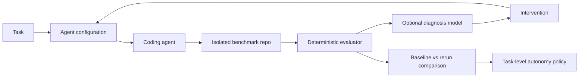

# Shadowline

Shadowline evaluates and improves coding-agent workflows, then uses evidence to recommend how much human oversight a class of engineering work needs.

## Problem

Coding agents increase implementation throughput, but uniform review requirements leave engineers inspecting every change with the same intensity. Teams need to understand failure causes, improve task inputs, and determine where autonomy is earned.

## Run locally

Node.js 22 or newer and npm are required. No environment variables or API keys are needed.

```sh
npm ci
npm run dev
```

Open http://localhost:3000. Start with the dashboard's pagination failure spotlight, inspect its intervention, then open the improved fixture or experiment comparison.

```sh
npm run typecheck
npm run lint
npm test
npm run build
npm start
```

Browser checks (first install Chromium):

```sh
npx playwright install chromium
npm run test:e2e
```

The browser suite starts its own production server on port 3100 and expects a completed build. It checks every fixture route, unknown-run behavior, filtering, navigation, the disabled rerun button, and mobile layout.

## Core workflow

Give an agent a task and a configuration, evaluate its patch with executable checks, diagnose likely failure causes, intervene, rerun the same task, and compare evidence. Diagnosis remains a hypothesis. Re-evaluation determines whether the new attempt meets the checks.



**AI proposes; deterministic software verifies.** The diagram is the intended architecture, not a claim that an execution pipeline exists today.

## Current prototype status

Phase 1 is fixture-driven. Implemented:

- Next.js App Router, TypeScript, Tailwind CSS, Zod, and Recharts.
- Dashboard (`/`), searchable/filterable runs (`/runs`), evidence detail (`/runs/[id]`), and experiments (`/experiments`).
- Twelve inspectable attempts across eleven tasks, including pagination baseline `SL-1042` and improved fixture `SL-1043`.
- Runtime-validated domain fixtures and interfaces for future agent, evaluator, and diagnosis adapters.
- An explainable, provisional autonomy policy. No recommendation changes runtime permissions.

No database, LLM integration, agent execution, benchmark implementation, persistence, or real measured outcomes exist. The intervention button is deliberately disabled. Benchmark paths shown in the UI describe the future fixture repository; those source files are not implemented here.

Dashboard metrics are calculated from the twelve inspectable attempts. Experiment cohorts (100 attempts per arm) and category history are separate authored fixtures; neither is inferred from the run table. Costs are illustrative USD estimates. Details and denominators are in [architecture](docs/architecture.md).

## Code map

- `app/` and `components/`: routes, shared shell, tables, and evidence views.
- `lib/domain/`: Zod schemas and inferred TypeScript types.
- `lib/fixtures/`: tasks, configuration snapshots, runs, experiment, and category history.
- `lib/agent/`, `lib/evaluator/`, `lib/diagnosis/`: provider-neutral contracts only.
- `lib/policy/autonomy.ts`: risk-aware placeholder policy.
- `docs/`: [product](docs/product.md), [architecture](docs/architecture.md), and [decisions](docs/decisions/001-deterministic-evaluation.md).

## Planned next milestone

Build the small customer-service benchmark and an isolated deterministic runner first. Seed the legacy `Customer[]` contract, add the deliberately breaking pagination patch, and prove the evaluator catches it. Then verify a compatible patch passes from the same clean revision. Keep hidden contracts outside the agent-editable workspace. Add an agent adapter only after the evaluator is trustworthy; add diagnosis afterward.
