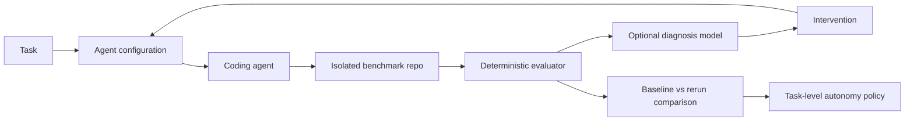

# Shadowline

Shadowline evaluates and improves coding-agent workflows, then uses evidence to recommend how much human oversight a class of engineering work needs.

## Problem

Coding agents increase implementation throughput, but uniform review requirements leave engineers inspecting every change with the same intensity. Teams need to understand failure causes, improve task inputs, and determine where autonomy is earned.

## Example customer engagement

[/engagement](http://localhost:3000/engagement) presents **Northstar Software**, a fictional 25-person B2B SaaS engineering organization. A small dashboard card opens the engagement. Its business assumptions are explicitly illustrative: **210 agent-generated tasks/month, 63 human review hours/month, and 23% requiring meaningful rework**. None are Shadowline measurements.

### Existing workflow

Linear ticket → engineer assembles context → coding agent → CI → senior engineer reviews → rework or merge. Manual, inconsistent context; uniform review; and individually repaired recurring failures are the three bottlenecks. This is a scenario, not a Linear or CI integration.

### Customer constraints

Contract checks protect existing APIs; isolated, curated coding context excludes hidden evaluation criteria; structured proposals and disabled/sandboxed coding-agent tools prevent arbitrary shell execution. Deterministic checks remain authoritative, high-risk work retains human review, and the generic provider interface keeps Codex CLI and Gemini usable. The engagement page maps all six requirements to these existing decisions; it grants no production permissions.

### Hypothesis

“API tasks may be failing because agents lack repository-specific context and explicit acceptance criteria, rather than because the model is incapable of performing the task.” This remains a hypothesis.

### Real experiment

The engagement reads the saved Phase 4 experiment `1ede9ceb-1c45-4d5f-9c39-9b638f65216d` and its two real run records. Local mode reads `.shadowline`; hosted demo mode reads the bundled public snapshot. There is no fixture fallback. Full run inspection is available in development and hosted demo mode; execution remains local-development-only.

| Measured evidence      | Baseline                | Context-rich            |
| ---------------------- | ----------------------- | ----------------------- |
| Provider / model       | codex-cli / gpt-6-astra | codex-cli / gpt-6-astra |
| Public tests           | 7 passed / 4 failed     | 11 passed / 0 failed    |
| Contract tests         | 2 passed / 14 failed    | 16 passed / 0 failed    |
| Overall result         | FAILED                  | PASSED                  |
| Benchmark human review | Required                | Not required            |
| Coding-attempt runtime | 19.429s                 | 11.187s                 |
| Total tokens           | 3,720                   | 4,221                   |

Same task, provider/model, benchmark, and deterministic evaluator; only task/context configuration changed. The approved intervention added `docs/api-conventions.md`, `src/lib/pagination.ts`, explicit `page`/`pageSize` semantics, historical `Customer[]` compatibility, and validation expectations. Hidden tests stayed out of the coding prompt. The result supports this intervention on this benchmark; one attempt per configuration cannot establish general reliability or eliminate generation variability. Northstar production savings, review duration, and rework reduction were not measured. Runtime/tokens exclude diagnosis and human approval; inference cost is unavailable.

### Recommendation

**LIGHT HUMAN REVIEW — PILOT** for eligible low-risk API changes, after the rollout gate. Provide relevant implementation files, API conventions, shared utilities, and explicit compatibility requirements; require typecheck, public/unit, integration, and contract tests. **Do not automatically merge production changes.** High-risk work remains human-reviewed.

Phase 1: shadow/pilot on **20–30 API tasks** while retaining current review; measure first-pass acceptance, critical regression rate, review duration, and remediation/rework time. Phase 2: reduce review only if reliability stays above a **customer-defined threshold** with **zero critical regressions**. No numeric threshold is assumed. A critical regression triggers rollback to full review.

### Illustrative ROI

Customer assumptions only: **210 tasks/month**, **63 current review hours/month**. If **90 low-risk tasks/month** eventually qualify and average review falls from **18 to 8 minutes**, then `90 × (18 − 8) ÷ 60 = 15` engineering hours/month could be recovered. All inputs and this calculated output are illustrative, not measured savings. Other tasks’ review time is assumed unchanged. This excludes rollout overhead, inference costs, and rework savings; the 23% rework assumption is not monetized. No dollar ROI is claimed.

## Run locally

Node.js 22 or newer and npm are required. Fixture views and known-patch verification need no API key. Real agent execution currently requires macOS with working `sandbox-exec` and either a locally authenticated Codex CLI or a Gemini Developer API key.

```sh
npm ci
npm run benchmark:setup
npm run dev
```

Open http://localhost:3000/verification to execute baseline readiness or either pagination patch. Overview starts the recorded product walkthrough; Experiments lists saved comparisons. Illustrative runs and cohorts remain available in collapsed sections. Verification controls are available only with `npm run dev` and are disabled in production.

```sh
npm run typecheck
npm run lint
npm test
npm run benchmark:verify
npm run build
npm start
```

Browser checks (first install Chromium):

```sh
npx playwright install chromium
npm run test:e2e
```

The browser suite starts production on port 3100 and development on port 3101. It expects a completed build and installed benchmark dependencies. It preserves the original route/filter/navigation/mobile checks and additionally verifies real patch evaluation, request restrictions, and the production-disabled execution route.

## Public Vercel demo

The hosted deployment is **read-only**. Reviewers can browse the dashboard, fixture runs, Northstar engagement, `/architecture`, `/agent` recorded runs, `/experiments/real`, and complete real run/experiment evidence. One understated header badge reads “Recorded demo”; execution remains disabled server-side. Measured results, fixture aggregates, and illustrative customer assumptions remain distinct.

1. Commit the application changes **including `data/demo/evidence.json`** and import the repository into Vercel. Use the **Next.js** framework preset and the repository root.
2. Use **`npm ci`** for installation and **`npm run build`** for the build; leave the output directory at the Next.js default. Use a Vercel-supported Node.js version satisfying `package.json` (`>=22`). Do not run `benchmark:setup`, tests that execute benchmarks, `agent:run`, or diagnosis/export scripts as deployment build steps.
3. In Vercel Project Settings → Environment Variables, set **`SHADOWLINE_DEMO_MODE=true`** for **Production and Preview**, then deploy/redeploy. This is the **only required environment variable**; there is no `NEXT_PUBLIC_` counterpart. [Vercel environment variable documentation](https://vercel.com/docs/environment-variables).
4. Do **not** configure Gemini/OpenAI API keys, Codex credentials, CLI paths, or model/cost overrides for the demo. The deployment needs no local `.env.local`, `.shadowline` store, benchmark dependencies, Codex installation, macOS sandbox, or writable application filesystem. `.vercelignore` also excludes local credentials/state from CLI uploads.
5. Verify `/engagement`, `/experiments/real/1ede9ceb-1c45-4d5f-9c39-9b638f65216d`, and both linked real runs. `/verification` explains local-only execution and links to saved results. Execution, diagnosis, intervention edits, approvals, and reruns return **403** in demo mode, even if called directly or while `NODE_ENV=development`.

`SHADOWLINE_DEMO_MODE=false` or unset preserves the existing local-development behavior and local stores. Non-demo production retains the existing 404 protection for execution pages/APIs. The flag is server-side and passed as a boolean to navigation/controls; it is not a client-controlled authorization setting. No live provider is contacted in demo mode.

### Bundled evidence and provenance

`data/demo/evidence.json` is a static server-bundled snapshot of **eight actual local attempts** (the failed baseline, passing context-rich run, and six provider errors) and **one approved real experiment**. Nothing is generated at build time. Historical Gemini 3.8 errors retain their original bytes locally and raw statuses in the snapshot; the existing compatibility reader labels them `PROVIDER_ERROR` without counting them as coding failures. Baseline: **7/11 public, 2/16 contract, FAILED, 19.429s, 3,720 tokens**. Context-rich: **11/11 public, 16/16 contract, PASSED, 11.187s, 4,221 tokens**. Costs remain unknown.

Only local repository and temporary workspace paths in recorded logs are redacted in the public copies. Outcomes, generated code, prompts, approval evidence, timing, and usage are otherwise preserved. The manifest records original-file SHA-256 and public-record SHA-256 (over compact `JSON.stringify(record)`); saved prompt/approval/baseline hashes refer to local originals. Original `.shadowline` records are never rewritten. The snapshot is intentionally public evidence, not a credentials or local-state export.

To deliberately refresh this reviewed snapshot locally, run `npm run demo:export`, inspect the diff, then format `data/demo/evidence.json` with Prettier before committing. The exporter uses an explicit record-ID allowlist, validates schemas, redacts paths, and rejects credential-like values. It never runs an agent or evaluator and is **not** part of the build or runtime. New local runs are not automatically published.

### Hosted demo validation

```sh
SHADOWLINE_DEMO_MODE=true npm run build
npm run test:demo
```

The additional browser suite uses production port 3102 with demo mode on, blank provider credentials, a nonexistent Codex binary, and a runtime guard that rejects child processes and local-only file access. It verifies real evidence, all inspection views, disabled controls, direct mutation rejection, and mobile layout. Run the original `npm run test:e2e` with demo mode false/unset to retain the existing local execution checks. Unit tests also load the bundle from an empty working directory to verify that `.shadowline` files and writes are unnecessary.

## UI organization

Primary navigation is Overview, Runs, Experiments, Engagement, and Architecture. Overview leads with Start experiment and recent activity; Experiments lists measured comparisons. The recorded walkthrough follows `/experiments/new` → saved baseline → saved diagnosis → approved setup → saved rerun → comparison and pilot recommendation. Task setup uses the original run contexts. Diagnosis and setup views live under `/experiments/real/[id]/diagnosis` and `/experiments/real/[id]/setup`. These navigation steps make no provider calls, approvals, or record writes; historical approval is labeled explicitly. Local execution remains accessible through the existing Coding Agent controls. Runs defaults to coding outcomes, groups provider incidents without counting them as coding failures, and keeps illustrative records behind an explicit disclosure. Fixture policy levels are unchanged and labeled illustrative.

Run details lead with Task, Agent setup, Tests & checks, Review decision, and the next action. Exact context, full coding prompts, generated patches, test output, diagnosis evidence, and hashes/provenance remain inspectable behind disclosures. The recorded approved setup shows all six context files and the saved acceptance criteria and checks; local editable approvals retain the existing controls. For real pagination runs, **critical failure** specifically means a failed evaluator-marked legacy API compatibility assertion; other contract failures still fail acceptance without necessarily being critical. No evaluator semantics changed.

Northstar is an engagement workspace: workflow, constraints, hypothesis, measured comparison, pilot policy, rollout, and illustrative ROI. The product thesis and broader scientific cautions remain documented here and in the ADRs rather than repeated on every screen. Local execution controls and hosted-demo protections are unchanged.

## Core workflow

Give an agent a task and a configuration, evaluate its patch with executable checks, diagnose likely failure causes, intervene, rerun the same task, and compare evidence. Diagnosis remains a hypothesis. Re-evaluation determines whether the new attempt meets the checks.



**AI proposes; deterministic software verifies.** Real coding-agent generation, AI failure hypotheses, editable intervention review, explicit human approval, and deterministic re-evaluation are implemented. Recommendations never execute automatically.

## Current prototype status

| Phase                                                   | Status                                     |
| ------------------------------------------------------- | ------------------------------------------ |
| Phase 1: Fixture-driven product/UI                      | COMPLETE                                   |
| Phase 2: Controlled benchmark + deterministic evaluator | COMPLETE                                   |
| Phase 3: Real coding-agent execution                    | COMPLETE; real baseline evaluated          |
| Phase 4: Failure diagnosis + intervention experiments   | COMPLETE; approved context-rich run passed |

Implemented:

- Next.js App Router, TypeScript, Tailwind CSS, Zod, and Recharts.
- Dashboard (`/`), searchable/filterable runs (`/runs`), evidence detail (`/runs/[id]`), and experiments (`/experiments`).
- Twelve inspectable attempts across eleven tasks, including pagination baseline `SL-1042` and improved fixture `SL-1043`.
- Runtime-validated domain models, provider interfaces, and a real controlled evaluator.
- An explainable, provisional autonomy policy. No recommendation changes runtime permissions.
- A small Hono customer API, existing pagination helper, public tests, independent contracts, and two known patches.
- Fresh temporary workspaces, fixed validation commands, structured output, file-scope checks, and cleanup.

Codex CLI and Gemini generate structured file replacements server-side through the same provider interface. Real attempts persist in local JSON and are inspectable at `/agent`; deterministic checks own acceptance. Real diagnosis/intervention experiments are available under `/experiments/real` in development. No database, automatic intervention, or automatic retry exists. The original fixture “Apply intervention & rerun” button remains disabled. Real agent runs and known-patch verification never update fixture aggregate metrics.

## Prove the evaluator

```sh
npm run benchmark:verify                         # all three cases
npm run benchmark:verify -- pagination-breaking # one known patch
```

| Case                  | Typecheck | Public tests | Contracts | Critical | Overall |
| --------------------- | --------- | ------------ | --------- | -------- | ------- |
| Baseline readiness    | PASS      | 7 / 7        | 1 / 1     | No       | PASSED  |
| Breaking pagination   | PASS      | 11 / 11      | 14 / 16   | Yes      | FAILED  |
| Compatible pagination | PASS      | 11 / 11      | 16 / 16   | No       | PASSED  |

The baseline intentionally has no pagination yet; its smaller suite checks repository readiness. Both patches get identical pagination acceptance tests. The breaking patch returns an envelope even without pagination parameters; its two failures are the no-query and unrelated-query legacy-array contracts. The compatible patch returns the historical full `Customer[]` unless the caller supplies page/pageSize. Invalid inputs return documented HTTP 400 errors.

The CLI prints captured stdout/stderr, exit codes, counts, timing, fingerprints, and cleanup status. Its exit code checks the **expected outcome**, so a correctly detected breaking patch is a successful verification demonstration. Setup installs locked dependencies once with lifecycle scripts disabled; subsequent runs reuse them without installs or network calls.

The Phase 2 endpoint accepts only reviewed, checked-in patches. The separate real-agent path executes generated application code through an OS-restricted worker; see [agent trust boundary](docs/decisions/004-agent-trust-boundary.md).

The original aggregate metrics remain derived from twelve fixture attempts, but are no longer the Overview hero. Overview reads the real saved experiment and linked runs. Experiment cohorts (100 attempts per arm) and category history are separate authored fixtures; neither is inferred from the run table. Costs are illustrative USD estimates. Details and denominators are in [architecture](docs/architecture.md).

## Code map

- `app/` and `components/`: routes, shared shell, tables, and evidence views.
- `lib/domain/`: Zod schemas and inferred TypeScript types.
- `lib/fixtures/`: tasks, configuration snapshots, runs, experiment, and category history.
- `lib/evaluator/{runner,checks,workspace}.ts`: real evaluation, hard-coded commands, and isolation/cleanup.
- `lib/evaluator/benchmark.ts`: the single task's evaluator-owned requirements.
- `benchmark-repo/`: customer API, conventions, pagination utility, and public/hidden tests.
- `benchmarks/`: controlled route replacements and public pagination acceptance tests.
- `lib/agent/`: explicit context builder, generic provider interface, Gemini REST and Codex CLI adapters, path validation, execution, and local JSON store.
- `lib/evaluator/{sandbox.ts,bridge.mjs,worker.mjs}`: restricted application subprocess and trusted test transport.
- `lib/diagnosis/`: bounded evidence builder for real AI failure hypotheses; the older fixture interface remains separate.
- `lib/experiments/`: structured diagnosis/intervention schemas, approval and execution lifecycle, local evidence store, and measured comparisons.
- `lib/policy/autonomy.ts`: risk-aware placeholder policy.
- `docs/`: [product](docs/product.md), [architecture](docs/architecture.md), and [decisions](docs/decisions/001-deterministic-evaluation.md).

## Run the real coding agent

For **Codex CLI**, install the CLI and run `codex login` locally. Shadowline uses file-backed authentication from `CODEX_HOME/auth.json` or `~/.codex/auth.json`, without an API key. Set `SHADOWLINE_CODEX_BIN` in `.env.local` to an absolute executable path if `codex` is not on the server's PATH. `SHADOWLINE_CODEX_MODEL` defaults to `gpt-6-astra` and is independent of the Gemini setting. The adapter ignores personal project/configuration instructions, disables tools, and invokes non-interactive `codex exec` with a JSON output schema in a restricted empty directory. Codex cannot read or modify the benchmark repository. Shadowline alone validates and applies proposed files. See [CLI isolation and version requirements](docs/decisions/005-codex-cli-provider.md).

For **Gemini**, create `.env.local` from `.env.example` and set `GEMINI_API_KEY` locally. Never use a `NEXT_PUBLIC_` key. The key is used only in the server's Gemini request header; generated code receives a minimal environment without credentials.

`SHADOWLINE_MODEL` defaults to `gemini-3.7-flash`. Google's [pricing](https://ai.google.dev/gemini-api/docs/pricing) lists it as free-tier eligible and suited to coding. Use a free-tier Google AI Studio project; model eligibility does not establish your project's billing tier. Quota/authentication errors are recorded without automatic retry, model fallback, or billing upgrade. Free-tier requests use Google's applicable data-use terms. Only the selected benchmark context is sent.

Open http://localhost:3000/agent, select a provider and Baseline or Context-rich, and click **Run coding agent**. Alternatively, explicitly start one attempt:

```sh
npm run agent:run -- baseline codex-cli
# Alternate provider (a separate attempt):
npm run agent:run -- baseline gemini
# A separate, explicitly requested experiment:
npm run agent:run -- context-rich codex-cli
```

Each invocation starts one generation attempt from the unchanged benchmark. Neither adapter automatically retries or falls back to another model. The CLI may also perform model-catalog discovery. No evaluator feedback goes back to the model. Both configurations receive the same independent acceptance checks. Baseline supplies exactly `src/app.ts`, `src/routes/customers.ts`, `src/data/customers.ts`, and `tests/customers.test.ts`. It excludes the conventions document, pagination helper, explicit compatibility criterion, and hidden tests. Context-rich adds the conventions and helper, the historical-array criterion, and requested contract/integration validation. The UI preserves exact contents, hashes, criteria, prompts, provider/model, before/replacement code, rejected/applied paths, checks, and review policy.

Gemini usage includes thinking tokens in output. Gemini inference cost remains null unless all three optional operator rate variables are configured; confirmed free-tier operators can explicitly set all rates to zero. Codex records CLI-reported token usage, while cost remains null because local-login usage cannot be priced using the Gemini rate settings. Remediation effort remains null. No ROI is inferred.

Real records live in git-ignored `.shadowline/runs/<uuid>.json` with owner-only file permissions. Attempt numbers are scoped to task + configuration + provider + requested model. First-pass acceptance is true only when the first non-provider-error coding attempt passes all checks. `PROVIDER_ERROR` covers upstream API/transport failures, with null evaluation and first-pass acceptance; these requests are excluded from coding failures, benchmark failures, and autonomy evidence. Request numbering still includes outages for transparency. Historical 3.8 API failures are classified as provider errors on read; their original JSON files remain unchanged. A file lock serializes UI/CLI attempts. Persistence is local, unencrypted, and single-machine; it is not a database or tamper-proof audit log. Deleting records also deletes attempt history.

If the host is forcibly stopped, a `RUNNING` record, temporary workspace, or `.shadowline/runs/.attempt.lock` may remain. Confirm the recorded PID is no longer executing before removing that lock and starting a new attempt. An interrupted run never becomes a pass automatically. Detail pages can be refreshed while an attempt runs. Non-demo production returns 404 for agent pages and the API; hosted demo mode exposes recorded views with mutations blocked. Use `npm run dev` with demo mode false/unset for local execution. Stop an existing dev server before browser tests because Next uses one development build lock.

The Gemini requests are documented in [Phase 3 evidence](docs/phase3-first-run.md). Initial Codex integration and offline checks are documented in [Codex run evidence](docs/phase3-codex-run.md). The subsequent real baseline `4b299b77-b63f-4ee3-ae13-06c5e0d2f956` succeeded at generation, passed typecheck, and failed acceptance (public 7/11; contracts 2/16), with no critical regression and human review required.

## Real diagnosis and intervention experiment

Open [the real experiment](http://127.0.0.1:3000/experiments/real/1ede9ceb-1c45-4d5f-9c39-9b638f65216d) or navigate from **Experiments → Open real experiments**. The baseline page also links its diagnosis evidence. The original baseline record is never rewritten.

The real diagnosis is a **CONTEXT_GAP** hypothesis, with **ACCEPTANCE_CRITERIA** and **VALIDATION_GAP** as secondary classifications. It attributes the invented `limit` API to missing conventions/helper context and underspecified criteria. Supporting evidence, exact diagnostic inputs, and provider usage are inspectable. This explanation cannot change the failed baseline verdict.

The proposed intervention adds `docs/api-conventions.md` and `src/lib/pagination.ts` to the same four baseline files. It adds explicit `page`/`pageSize` semantics, documented helper/response/error-contract guidance, and the compatibility criterion that existing callers retain the historical `Customer[]` response. Requested validation is TYPECHECK, PUBLIC, INTEGRATION, and CONTRACT. The AI recommendation requested three check categories; the engineer draft explicitly adds INTEGRATION to match the existing context-rich configuration. Diagnosis prose, hidden-test failures, and exact hidden assertions never enter the coding prompt. Repository conventions provide intent.

The engineer can edit the selected context, criteria, checks, and rationale, save the proposal, and inspect the exact coding prompt. **Approve intervention** binds approval to that saved proposal. A separate **Run one approved attempt** action starts execution. Editing invalidates approval; stale approval or changed benchmark/evaluator inputs block execution. Each experiment can execute once, including when its provider fails. A crash never authorizes an automatic retry. The comparison displays real before/after measurements, unknown metrics, review requirements, and a bounded interpretation.

After explicit approval of revision 1, exactly one context-rich attempt ran with the same `codex-cli` provider, `gpt-6-astra` model, and benchmark. Run `c0cc3ec2-68b7-43d6-8981-42728a91bd38` passed. No retry was made.

| Measured result                                   | Baseline                  | Context-rich              |
| ------------------------------------------------- | ------------------------- | ------------------------- |
| Provider                                          | Succeeded                 | Succeeded                 |
| Typecheck                                         | Passed                    | Passed                    |
| Public tests                                      | 7 passed / 4 failed       | 11 passed / 0 failed      |
| Contract tests                                    | 2 passed / 14 failed      | 16 passed / 0 failed      |
| Files proposed / applied                          | `src/routes/customers.ts` | `src/routes/customers.ts` |
| Critical failure                                  | No                        | No                        |
| Overall                                           | FAILED                    | PASSED                    |
| Human review required by benchmark                | Yes                       | No                        |
| First coding attempt accepted (per configuration) | No                        | Yes                       |
| Coding-attempt runtime                            | 19,429 ms                 | 11,187 ms                 |
| Tokens (input / output / total)                   | 3,204 / 516 / 3,720       | 3,976 / 245 / 4,221       |
| Inference cost                                    | Unknown                   | Unknown                   |

Diagnosis separately consumed 17,693 ms and 8,267 reported tokens; its cost is also unknown. Both coding attempts reported zero cached input tokens. The context-rich patch reused the pagination helper and documented error contract. The baseline, benchmark, hidden tests, evaluator, and prior records remain unchanged. This paired result supports the combined intervention on this benchmark; it does not establish universal diagnosis accuracy, general reliability, or which individual input addition caused the improvement. See [the complete real experiment evidence](docs/phase4-real-experiment.md).

To create a new diagnosis only (not a coding rerun):

```sh
npm run experiment:diagnose -- <failed-baseline-run-id>
```

Experiments are stored separately in `.shadowline/experiments/<uuid>.json`, with baseline byte hashes, protected-input digests, exact prompts, approval provenance, and linked coding-run IDs. Execution and edits remain local and development-only; explicitly exported records are inspectable in the read-only hosted demo. The successful baseline used `codex-cli 0.155.0-alpha.16.3`; this machine pins `SHADOWLINE_CODEX_BIN` to that installed, sandbox-compatible executable. The newly installed CLI 0.158.0 failed managed-preferences startup inside the unchanged sandbox, before generation. No sandbox protections were relaxed.

See [ADR 006](docs/decisions/006-diagnosis-and-interventions.md): AI-generated diagnosis is a hypothesis; deterministic re-evaluation validates interventions. A passing pair supports this intervention on this benchmark, not universal diagnosis accuracy, population reliability, or autonomous production deployment.

## Next milestone

Collect more explicitly approved, matched experiments before drawing reliability or autonomy conclusions. Preserve failed interventions and provider outages, measure diagnosis overhead separately, and test input changes individually to distinguish their effects from sampling variability.
