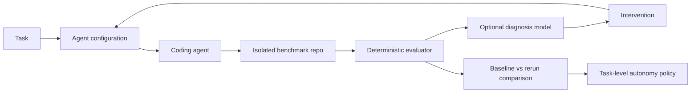

# Shadowline

Shadowline evaluates and improves coding-agent workflows, then uses evidence to recommend how much human oversight a class of engineering work needs.

## Problem

Coding agents increase implementation throughput, but uniform review requirements leave engineers inspecting every change with the same intensity. Teams need to understand failure causes, improve task inputs, and determine where autonomy is earned.

## Run locally

Node.js 22 or newer and npm are required. No environment variables or API keys are needed.

```sh
npm ci
npm run benchmark:setup
npm run dev
```

Open http://localhost:3000/verification to execute baseline readiness or either pagination patch. The dashboard and existing run/experiment pages retain their fixture data. Verification controls are available only with `npm run dev` and are disabled in production.

```sh
npm run typecheck
npm run lint
npm test
npm run benchmark:verify
npm run build
npm start
```

Browser checks (first install Chromium):

```sh
npx playwright install chromium
npm run test:e2e
```

The browser suite starts production on port 3100 and development on port 3101. It expects a completed build and installed benchmark dependencies. It preserves the original route/filter/navigation/mobile checks and additionally verifies real patch evaluation, request restrictions, and the production-disabled execution route.

## Core workflow

Give an agent a task and a configuration, evaluate its patch with executable checks, diagnose likely failure causes, intervene, rerun the same task, and compare evidence. Diagnosis remains a hypothesis. Re-evaluation determines whether the new attempt meets the checks.



**AI proposes; deterministic software verifies.** The agent, diagnosis, and automatic intervention portions of this diagram are still planned. Controlled patch evaluation now works.

## Current prototype status

| Phase                                                   | Status          |
| ------------------------------------------------------- | --------------- |
| Phase 1: Fixture-driven product/UI                      | COMPLETE        |
| Phase 2: Controlled benchmark + deterministic evaluator | COMPLETE        |
| Phase 3: Coding-agent generation                        | NOT IMPLEMENTED |

Implemented:

- Next.js App Router, TypeScript, Tailwind CSS, Zod, and Recharts.
- Dashboard (`/`), searchable/filterable runs (`/runs`), evidence detail (`/runs/[id]`), and experiments (`/experiments`).
- Twelve inspectable attempts across eleven tasks, including pagination baseline `SL-1042` and improved fixture `SL-1043`.
- Runtime-validated domain models, provider interfaces, and a real controlled evaluator.
- An explainable, provisional autonomy policy. No recommendation changes runtime permissions.
- A small Hono customer API, existing pagination helper, public tests, independent contracts, and two known patches.
- Fresh temporary workspaces, fixed validation commands, structured output, file-scope checks, and cleanup.

No database, LLM integration, real coding agent, diagnosis model, automatic intervention, or persistence exists. The original “Apply intervention & rerun” button remains disabled. Real verification results are returned separately and never update fixture metrics.

## Prove the evaluator

```sh
npm run benchmark:verify                         # all three cases
npm run benchmark:verify -- pagination-breaking # one known patch
```

| Case                  | Typecheck | Public tests | Contracts | Critical | Overall |
| --------------------- | --------- | ------------ | --------- | -------- | ------- |
| Baseline readiness    | PASS      | 7 / 7        | 1 / 1     | No       | PASSED  |
| Breaking pagination   | PASS      | 11 / 11      | 14 / 16   | Yes      | FAILED  |
| Compatible pagination | PASS      | 11 / 11      | 16 / 16   | No       | PASSED  |

The baseline intentionally has no pagination yet; its smaller suite checks repository readiness. Both patches get identical pagination acceptance tests. The breaking patch returns an envelope even without pagination parameters; its two failures are the no-query and unrelated-query legacy-array contracts. The compatible patch returns the historical full `Customer[]` unless the caller supplies page/pageSize. Invalid inputs return documented HTTP 400 errors.

The CLI prints captured stdout/stderr, exit codes, counts, timing, fingerprints, and cleanup status. Its exit code checks the **expected outcome**, so a correctly detected breaking patch is a successful verification demonstration. Setup installs locked dependencies once with lifecycle scripts disabled; subsequent runs reuse them without installs or network calls.

Only reviewed, checked-in patches are accepted. Temporary directories are not an OS sandbox for arbitrary generated code; see [controlled execution](docs/decisions/003-controlled-execution.md).

Dashboard metrics are calculated from the twelve inspectable attempts. Experiment cohorts (100 attempts per arm) and category history are separate authored fixtures; neither is inferred from the run table. Costs are illustrative USD estimates. Details and denominators are in [architecture](docs/architecture.md).

## Code map

- `app/` and `components/`: routes, shared shell, tables, and evidence views.
- `lib/domain/`: Zod schemas and inferred TypeScript types.
- `lib/fixtures/`: tasks, configuration snapshots, runs, experiment, and category history.
- `lib/evaluator/{runner,checks,workspace}.ts`: real evaluation, hard-coded commands, and isolation/cleanup.
- `lib/evaluator/benchmark.ts`: the single task's evaluator-owned requirements.
- `benchmark-repo/`: customer API, conventions, pagination utility, and public/hidden tests.
- `benchmarks/`: controlled route replacements and public pagination acceptance tests.
- `lib/agent/`, `lib/diagnosis/`: interfaces only.
- `lib/policy/autonomy.ts`: risk-aware placeholder policy.
- `docs/`: [product](docs/product.md), [architecture](docs/architecture.md), and [decisions](docs/decisions/001-deterministic-evaluation.md).

## Planned next milestone

Connect one coding-agent adapter that returns file changes only, using the same pagination task and public context. Add the execution isolation needed for untrusted generated code, preserve the protected harness and command allowlist, then evaluate the returned patch against the same baseline. Keep diagnosis and automatic interventions for a later milestone.
