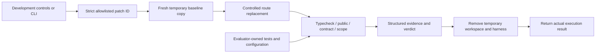
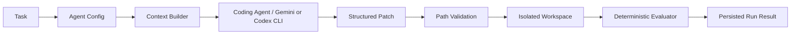

# Architecture

**AI proposes; deterministic software verifies.**

## Read-only hosted demo

`SHADOWLINE_DEMO_MODE=true` selects `lib/evidence/bundled.ts` through the read-only evidence reader interface. A static import of `data/demo/evidence.json` packages reviewed real records into the server build; no `.shadowline` directory or runtime writes are needed. The snapshot retains baseline/context-rich outcomes and provider-error history, with local machine paths redacted and source/public-copy hashes recorded. Authored fixture aggregates and illustrative Northstar assumptions remain separate sources.

The server renders the hosted notice and passes a boolean to controls/navigation. Real run and experiment pages are inspectable in demo production; `/architecture` summarizes the existing boundaries. Mutation endpoints reject demo requests before reading payloads or dynamically importing local execution services. Codex availability is not probed. Diagnosis, editing, approval, and benchmark execution controls are disabled. No model call or evaluator subprocess runs while building or serving the demo.

With the flag false/unset, evidence readers use the unchanged local stores and development execution behavior remains available. Non-demo production keeps its prior 404 execution gates. The exporter is an explicit local maintenance command, never a build or runtime hook. See the README for deployment and validation commands.

## Product shell and data boundaries

The Next.js App Router retains the Phase 1 fixture dashboard, run explorer, details, and experiments. Phase 2 adds a development-only `/verification` page and `/api/benchmark` POST endpoint that execute real checks. Zod validates domain data and evaluator request/response boundaries. The interface displays actual benchmark executions separately from authored aggregates. Phase 3 adds server-side Gemini and Codex CLI providers, `/agent`, `/agent/runs/[id]`, and `/api/agent`, with local JSON persistence for real attempts. No database is required. Development and production builds continue to use Webpack because Turbopack's CSS worker hit a local port restriction during Phase 1.

`lib/fixtures/` remains authored demo data. `lib/evaluator/` now performs deterministic evaluation. `EvaluationResult` retains separate unit, integration, contract, scope, and critical-failure fields; real executions additionally include public-suite totals, validation duration, and structured check records. A completed result cannot pass with failing checks or incomplete evidence. Known-patch results live in browser state or CLI output. Real agent results persist separately under `.shadowline/runs`; neither updates fixture metrics.

## Implemented Phase 2 execution

### Benchmark and patches

`benchmark-repo/` is a small TypeScript / Hono HTTP application with twelve fixed customers. It exposes `GET /customers` and initially returns the complete ordered `Customer[]`. The existing pagination utility implements page/pageSize parsing, defaults, bounds, offsets, slicing, and metadata. [Hono's request testing API](https://hono.dev/docs/guides/testing) exercises actual routing and HTTP responses without a listening port.

`lib/evaluator/benchmark.ts` owns the task prompt, allowed path, acceptance criteria, expected assertion counts, and critical-contract marker. `benchmarks/patches/` contains two full-file route replacements. This intentionally narrow representation avoids a general-purpose diff parser; requests accept only a patch ID, never replacement content, file paths, or commands. Both patches use the existing utility. The breaking patch substitutes default pagination when no opt-in is present; the compatible patch returns the original array in that case.

### Public versus independent validation

- The baseline's public suite contains 4 utility unit tests and 3 HTTP integration tests.
- The task adds 4 visible pagination integration tests from `benchmarks/public-tests/` to both patched evaluations.
- The baseline readiness contract checks the exact historical array response.
- Patched evaluations additionally run `pagination-contract.test.ts`: unrelated query parameters, invalid/repeated/unsafe pagination, pages beyond the dataset, and data immutability.

Baseline readiness deliberately does not run the new pagination acceptance tests. Its successful result means the starting repository works, not that the task is complete. This distinction is explicit in `purpose: BASELINE_READINESS` versus `PAGINATION_ACCEPTANCE` and in the UI. Baseline readiness and task acceptance percentages must never be aggregated as equivalent samples.

Both patches pass 11 public tests. The breaking patch fails 2 of 16 contracts, specifically the no-query and unrelated-query legacy-array assertions. Those assertions use the evaluator-owned `[critical:legacy-contract]` marker. An observed failure of either sets `criticalFailure: true`. Other pagination failures need not be critical. A timeout, missing report, or process error is never fabricated into a critical contract failure.

Use of the shared pagination abstraction is documented and visible in both patch files. It is intentionally not a static pass/fail gate: detecting arbitrary semantic reimplementation with source matching would be brittle. Correctness and compatibility remain executable gates.

### Workspace and dependency lifecycle

`workspace.ts` creates a fresh `shadowline-benchmark-*` directory under the OS temporary directory. Only source, documentation, public tests, and known configuration/manifest files enter its `workspace/` child. Hidden tests are excluded. Baseline files are SHA-256 hashed and the resulting manifest fingerprint is recorded with a separate patch fingerprint. This checkout has no required Git history; fingerprints identify the evaluated content without claiming a Git commit.

The sibling `harness/` directory receives trusted copies of public and hidden tests and generated, evaluator-owned compiler/Vitest configurations. Relative public-test imports resolve to the workspace's source. Patches can change only `src/routes/customers.ts`; they cannot select or modify the harness via the patch API. SHA-256 file manifests verify added, deleted, and modified files before and after validation, rejecting forbidden paths. Unexpected source symlinks are rejected.

Run `npm run benchmark:setup` once (`npm ci --prefix benchmark-repo --ignore-scripts`). Each workspace and harness links to the installed benchmark dependencies. No install, network download, or package lifecycle script runs during evaluation. Vitest's cache and JSON reports are stored under the temporary root. The shared dependency directory is trusted local tooling, not agent-writable patch scope. Lockfiles are checked in. Setup must be rerun after dependency changes.

All preparation and validation use `try/finally` cleanup. The response asserts `workspaceCleanedUp: true` only after recursive removal succeeds. A setup/cleanup failure produces an error response instead of a success claim. Tests verify cleanup on successful evaluations, expected failing evaluations, and a thrown callback, and verify that the original repository stays unchanged. Cleanup covers handled exits and failures; an uncatchable host termination can leave a temporary directory.

### Commands and result semantics

`checks.ts` invokes `process.execPath` with fixed argument arrays and `shell: false`:

1. The installed TypeScript CLI with `--noEmit` and the trusted compiler configuration.
2. The installed Vitest CLI with `run` and the trusted public configuration.
3. The installed Vitest CLI with `run` and the trusted hidden configuration.
4. An in-process file-manifest scope comparison.

No request can supply shell syntax, commands, flags, environment variables, or workspace paths. Benchmark package scripts are developer conveniences; the evaluator does not execute editable package scripts. Each subprocess gets a minimal environment rather than inherited credentials or NODE_OPTIONS, a 30-second timeout, and a 64-K-character cap on each output stream. Timeout or output overflow kills the process group on POSIX (the child process on Windows). Each check records exit code, duration, stdout, stderr, truncation, and individual assertions.

[Vitest JSON reports](https://vitest.dev/guide/reporters.html) supply assertion outcomes. The runner validates their shape, expected assertion count, counts versus individual outcomes, suite completion, and agreement with process exit status. Missing/malformed/incomplete reports cannot pass. Public assertions are partitioned into utility unit tests and HTTP integration tests; public totals are also displayed directly. Expected assertion counts are task-owned and must be deliberately updated when the harness changes.

Known failing assertions, failed typecheck, or forbidden file changes produce `FAILED`. Incomplete execution without an observed failure produces `REVIEW_REQUIRED`. Only complete successful evidence produces `PASSED`. Infrastructure/setup failure may instead return an explicit error without a verdict. A result is never based on a model judgment or single score.

### Local development boundary

The controls and POST route are unavailable in production (`404`). Development requests must originate from the same loopback origin and contain a small JSON object with exactly one allowed `patchId`. Concurrent evaluations are rejected with `409` within the local server process. This is deliberately not a public execution API or a distributed concurrency guarantee.

An isolated directory is **not an OS security sandbox**. Test code still executes with the local account's privileges, and shared dependency links do not enforce filesystem permissions. Phase 2 therefore executes only checked-in, reviewed patches; no arbitrary uploads or model-generated code are accepted. The real-agent path adds the restricted worker described in [ADR 004](decisions/004-agent-trust-boundary.md). The original known-patch boundary remains documented in [ADR 003](decisions/003-controlled-execution.md).

## Implemented Phase 3 agent workflow

The generic `ModelProvider` takes a `ContextSnapshot` and returns text plus nullable usage/response metadata. The Gemini adapter uses one server-side REST request, structured JSON output, a bounded response, a 180-second timeout, no tools, and no retries. The Codex CLI adapter uses non-interactive structured output with an isolated local login and an outer OS sandbox denying repository access; see [ADR 005](decisions/005-codex-cli-provider.md). The UI selects a registered provider. Context construction, patch validation, application execution, and evaluation are shared. Model/version and provider identity are recorded per run; CLI usage cost remains unknown.

`configs.ts` explicitly enumerates context files. Baseline receives only app wiring, customer route, customer data/types, and existing public customer tests. Context-rich adds conventions, pagination helper, the explicit legacy-array criterion, and requested integration/contracts. Neither receives hidden tests or evaluator source. `prompt.ts` records exact file contents/hashes and complete prompts. Requested validation never reduces the evaluator's fixed checks.

The host validates strict Zod output and all file paths before writing anything. The sole writable target is `src/routes/customers.ts`; no tests, manifests, lockfiles, application code, or evaluator files are editable. The complete proposal is rejected for any invalid, duplicate, traversal, absolute, or symlink path. Only the temporary copy receives writes.

Generated code is never imported into the trusted test process. Public/contract HTTP tests use a trusted stdio proxy. It sends request URLs to a macOS Seatbelt-restricted Node worker and checks actual HTTP responses. The worker can read benchmark source and runtime dependencies and write only disposable scratch. It cannot read hidden tests, reports, host credentials, or application source, or access the network. The trusted parent owns assertions and reports. Utility tests run against the immutable baseline helper. Source typechecking uses the existing trusted compiler configuration inside the OS sandbox too, preventing imports/reference directives from reading host files. Sandbox unavailability fails before a provider call; there is no unrestricted fallback. See ADR 004 for limitations.

`coding-agent.ts` preserves provider failures, schema/path rejections, evaluator results, cleanup, timing, and usage. Failed or incomplete code evaluation requires human review. Upstream HTTP/transport failures produce `PROVIDER_ERROR`, with no evaluation, no code-review requirement, and null first-pass acceptance. They are excluded from coding-attempt and benchmark-failure denominators and autonomy evidence. Critical failure means an observed legacy-contract assertion failure, not an infrastructure error. Acceptance means the benchmark passed, not that a production merge is authorized. First-pass acceptance requires the first non-provider-error coding attempt in the task/config/provider/model series to pass. Request ordinals still include all requests. Legacy HTTP-error records are reclassified on read without rewriting their original JSON; no attempts are silently removed.

The development API accepts only task/config IDs, same-origin loopback JSON requests, and a 1 KiB body. It accepts no credentials, model identifier, file content, commands, or paths from the browser. A cross-process filesystem lock serializes attempts. Local atomic JSON records are inspectable after restart but are not encrypted or immutable. Forced termination may leave incomplete records/locks; recovery is documented in README.

Model usage is measured when returned; missing usage/cost/remediation remains null. Optional explicit operator rates allow estimates, including confirmed zero-cost free-tier operation. No ROI is inferred. Fixture aggregates remain authored and separate.

## Phase 4: Real hypotheses and approved interventions

`lib/diagnosis/real.ts` assembles exact baseline context, generated replacements, bounded failure summaries, and repository intent for one structured diagnosis request. The same generic transport accepts a trusted caller-selected output schema; Zod validates classifications, explanation, evidence references, and the recommendation. No model can modify evaluation results. The original baseline JSON is preserved byte-for-byte; `lib/experiments/store.ts` stores linked diagnosis and experiment evidence separately.

The editable intervention combines the original task/files with selected repository-intent additions. Fixed context and criteria catalogs prevent arbitrary diagnostic text, hidden assertions, or file paths entering the coding prompt. Rationale remains review evidence. An explicit approval binds the saved proposal and exact input contents; editing invalidates it. Execution is separate and can consume that approval only once, including provider outages or interrupted runs. Baseline-record and protected-input hashes guard comparability. The existing generated-code validator, sandbox, and evaluator remain unchanged.

Development-only `/experiments/real` pages answer what failed, the AI hypothesis, the approved input change, the observed re-evaluation, and justified conclusions. `/api/experiments` has strict bounded same-origin actions. UI requests cannot supply providers, models, commands, test content, or arbitrary paths. Actual result, file, usage, cost, timing, first-pass, review, and critical-failure measurements come from the two linked coding runs; unavailable values stay unknown. Diagnosis overhead is separate.

A passing pair supports the combined intervention on this benchmark. It cannot establish universal diagnosis truth or isolate which added input mattered; model sampling variability remains a confounder. Autonomy recommendations remain downstream of broader reliability evidence. See [ADR 006](decisions/006-diagnosis-and-interventions.md).

## Visible evidence and fixture denominators

Every run page displays task-owned intent, exact agent inputs, changed files, time/tokens/cost, each evaluator result, critical-failure status, and authored findings. Successful, failed, and review-required outcomes are distinct. Skipped checks and scope warnings require review. Known failed tests, type errors, forbidden changes, and critical failures cannot pass schema validation.

The run explorer contains twelve attempts across eleven distinct tasks, including one second attempt. Dashboard calculations live in `getRunMetrics()`:

- First-pass success excludes the second attempt: 6 / 11.
- Regression rate counts existing-behavior regressions across all attempts: 3 / 12.
- Human review rate includes failed and review-required fixture attempts: 5 / 12. Future review requirements may also come from policy; passing does not universally waive review.
- Average cost per successful task includes all attempt spending: $1.70 / 7 distinct tasks with a passing attempt, displayed as $0.24.

The experiment's two 100-attempt cohorts and autonomy history are independent authored fixtures, not aggregates of the twelve visible runs or real executions. Pagination fixture evidence is aligned to the actual benchmark (4 unit, 7 integration, and 16 contract assertions; the breaking patch fails 2 contracts and is critical). Its dates, timing, token usage, cost, model/configuration, and diagnosis remain illustrative. No model has produced these patches. All costs are illustrative USD estimates, not provider pricing.

## Provisional policy v1

`lib/policy/autonomy.ts` returns validated evidence, reasons, a version, and `provisional: true`.

| Gate                                                                                                                                              | Recommendation |
| ------------------------------------------------------------------------------------------------------------------------------------------------- | -------------- |
| HIGH / CRITICAL task risk, or any critical failure                                                                                                | HUMAN          |
| LOW risk, at least 30 observations, at least 95% deterministic verification coverage, at least 95% historical reliability, zero critical failures | AUTO           |
| Everything else, including insufficient samples                                                                                                   | REVIEW         |

These thresholds are illustrative and uncalibrated. Category-wide reliability cannot override a particular task's risk. Verification coverage means required-check coverage, not an arbitrary AI score or a guarantee that the checks are sufficient. Future policy should handle recency, severity, confidence intervals, independence of observations, category granularity, and policy overrides. A zero-sample history never earns AUTO.

## Next implementation boundary

Collect repeated, explicitly approved comparisons before generalizing reliability or introducing intervention automation. Extending execution beyond this local macOS demo requires a maintained container/VM boundary with resource limits. No queues, vector database, microservices, authentication, or deployment abstraction is part of this prototype.
