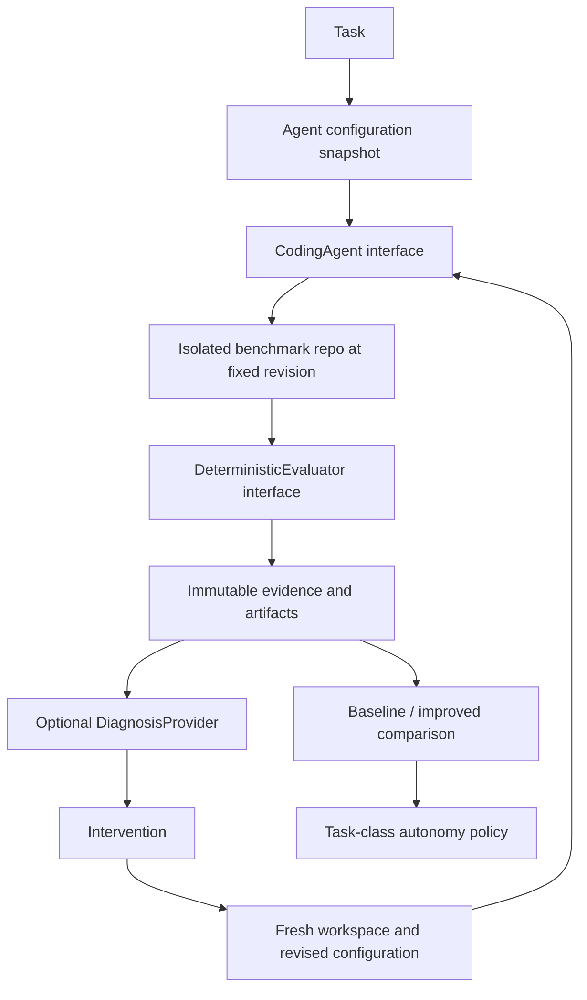

# Architecture

**AI proposes; deterministic software verifies.**

## Phase 1

The Next.js App Router renders local TypeScript fixtures. Zod parses fixtures at module boundaries; domain types are inferred from the same schemas to avoid drift. Server components own the pages and evidence views. Client components are limited to navigation state, run filtering, and the Recharts visualization. Tailwind CSS v4 supplies the styling foundation; plain semantic components and shared CSS keep the small interface inspectable. There is no data service, execution process, database, API key, or external font dependency. Development and production builds explicitly use Webpack because Turbopack's CSS worker could not bind its internal port in the initial restricted build environment; this does not change the App Router architecture.

`lib/fixtures/tasks.ts` holds tasks and immutable-in-practice configuration snapshots. `runs.ts` stores attempts with deterministic evidence, diagnosis hypotheses, and optional interventions. `experiments.ts` stores separately labeled aggregate comparison and category-history fixtures. Schema refinements reject a completed run without matching evidence or a passing result with known failing checks. Schemas are validation boundaries, not an evaluator implementation.

## Intended execution architecture

1. **Task:** target behavior, risk, expected context, evaluator-owned acceptance criteria, required checks, and allowed files.
2. **Agent configuration:** a complete input snapshot of model identifier, supplied files, acceptance criteria, requested validation, and notes. A task's ground-truth criteria and the criteria supplied to the agent are distinct. The baseline fixture receives only the title, while Shadowline retains the full task specification.
3. **Coding agent:** `lib/agent/types.ts` accepts the task, configuration, workspace, base revision, and cancellation signal, and returns a patch and usage. The future adapter must build the prompt only from the supplied configuration and task prompt, without leaking evaluator-owned hidden material. The adapter does not declare correctness.
4. **Isolated benchmark:** a fresh workspace for every attempt, pinned to one revision. No accumulated changes from a previous run. Only one controlled customer-service repository is in scope.
5. **Deterministic evaluator:** `lib/evaluator/types.ts` executes independently controlled checks. Collect exit status, test counts, skips, relevant logs, changed files from a trusted diff, scope violations, and critical failure flags. Hidden tests and harness configuration remain outside the agent-editable workspace. Agent-required checks may be weaker than evaluator-required checks; the former never lower the latter.
6. **Diagnosis:** `lib/diagnosis/types.ts` proposes likely causes with evidence. A diagnosis is a hypothesis; re-evaluation determines whether an intervention actually helped. Neither confidence nor prose may change the verdict.
7. **Intervention and rerun:** derive a new configuration, preserve lineage, and execute from the same base revision. Scope or model changes should be explicit. Phase 1's rerun button is disabled and the improved run is pre-authored.
8. **Comparison:** compare the same task set and evaluation checks, preserving denominators. A multivariable intervention can demonstrate a combined effect but cannot identify which input caused it. Future experiments should repeat attempts, record seeds when supported, and account for task difficulty and model version.
9. **Policy:** return a recommendation and reasons per task class. Never treat model confidence as verification evidence.

## Visible evidence and fixture denominators

Every run page displays task-owned intent, exact agent inputs, changed files, time/tokens/cost, each evaluator result, critical-failure status, and authored findings. Successful, failed, and review-required outcomes are distinct. Skipped checks and scope warnings require review. Known failed tests, type errors, forbidden changes, and critical failures cannot pass schema validation.

The run explorer contains twelve attempts across eleven distinct tasks, including one second attempt. Dashboard calculations live in `getRunMetrics()`:

- First-pass success excludes the second attempt: 6 / 11.
- Regression rate counts existing-behavior regressions across all attempts: 3 / 12.
- Human review rate includes failed and review-required fixture attempts: 5 / 12. Future review requirements may also come from policy; passing does not universally waive review.
- Average cost per successful task includes all attempt spending: $1.70 / 7 distinct tasks with a passing attempt, displayed as $0.24.

The experiment's two 100-attempt cohorts and autonomy history are independent authored fixtures, not aggregates of the twelve visible runs. No generated row expansion or false lineage is implied. The pagination pair illustrates the narrative without claiming to reproduce aggregate percentages. All costs are illustrative USD inference estimates, not provider pricing. Model identifiers are intentionally generic fixture labels.

## Provisional policy v1

`lib/policy/autonomy.ts` returns validated evidence, reasons, a version, and `provisional: true`.

| Gate                                                                                                                                              | Recommendation |
| ------------------------------------------------------------------------------------------------------------------------------------------------- | -------------- |
| HIGH / CRITICAL task risk, or any critical failure                                                                                                | HUMAN          |
| LOW risk, at least 30 observations, at least 95% deterministic verification coverage, at least 95% historical reliability, zero critical failures | AUTO           |
| Everything else, including insufficient samples                                                                                                   | REVIEW         |

These thresholds are illustrative and uncalibrated. Category-wide reliability cannot override a particular task's risk. Verification coverage means required-check coverage, not an arbitrary AI score or a guarantee that the checks are sufficient. Future policy should handle recency, severity, confidence intervals, independence of observations, category granularity, and policy overrides. A zero-sample history never earns AUTO.

## Next implementation boundary

Start with a local benchmark runner and fixed patches, before an LLM adapter. Pin a repository revision, create an isolated temporary workspace, apply an approved fixture patch, and run type/unit/integration/contract/scope checks with a timeout and constrained commands. Capture structured evidence, guarantee workspace cleanup, and keep evaluation harness artifacts protected from patch changes. Prove the legacy pagination contract fails for the breaking patch and passes for the compatible patch. Then implement `CodingAgent` against a single provider; persistence can follow when real runs need a durable evidence trail.

No queues, orchestration framework, vector database, microservices, authentication, or deployment abstraction is part of this architecture.
