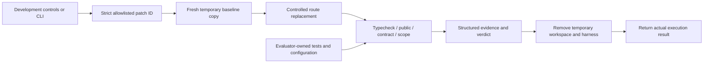
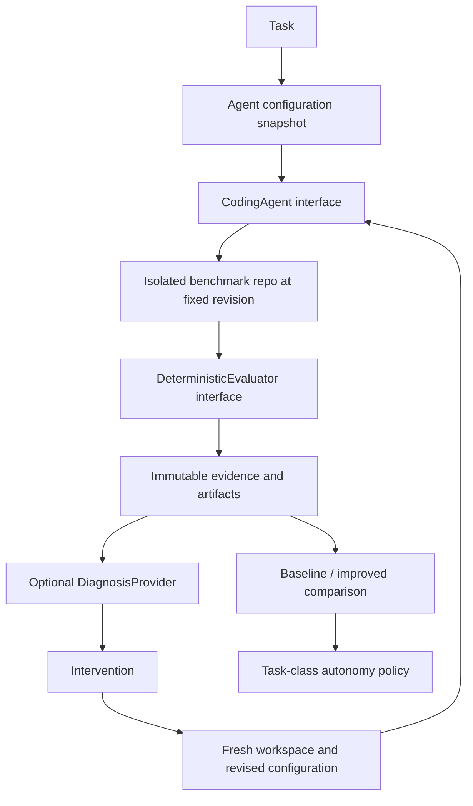

# Architecture

**AI proposes; deterministic software verifies.**

## Product shell and data boundaries

The Next.js App Router retains the Phase 1 fixture dashboard, run explorer, details, and experiments. Phase 2 adds a development-only `/verification` page and `/api/benchmark` POST endpoint that execute real checks. Zod validates domain data and evaluator request/response boundaries. The interface displays actual benchmark executions separately from authored aggregates. No database, API key, LLM, or agent execution exists. Development and production builds continue to use Webpack because Turbopack's CSS worker hit a local port restriction during Phase 1.

`lib/fixtures/` remains authored demo data. `lib/evaluator/` now performs deterministic evaluation. `EvaluationResult` retains separate unit, integration, contract, scope, and critical-failure fields; real executions additionally include public-suite totals, validation duration, and structured check records. A completed result cannot pass with failing checks or incomplete evidence. Actual results live only in the current browser state or CLI output; they do not update fixture metrics or persist anywhere.

## Implemented Phase 2 execution

### Benchmark and patches

`benchmark-repo/` is a small TypeScript / Hono HTTP application with twelve fixed customers. It exposes `GET /customers` and initially returns the complete ordered `Customer[]`. The existing pagination utility implements page/pageSize parsing, defaults, bounds, offsets, slicing, and metadata. [Hono's request testing API](https://hono.dev/docs/guides/testing) exercises actual routing and HTTP responses without a listening port.

`lib/evaluator/benchmark.ts` owns the task prompt, allowed path, acceptance criteria, expected assertion counts, and critical-contract marker. `benchmarks/patches/` contains two full-file route replacements. This intentionally narrow representation avoids a general-purpose diff parser; requests accept only a patch ID, never replacement content, file paths, or commands. Both patches use the existing utility. The breaking patch substitutes default pagination when no opt-in is present; the compatible patch returns the original array in that case.

### Public versus independent validation

- The baseline's public suite contains 4 utility unit tests and 3 HTTP integration tests.
- The task adds 4 visible pagination integration tests from `benchmarks/public-tests/` to both patched evaluations.
- The baseline readiness contract checks the exact historical array response.
- Patched evaluations additionally run `pagination-contract.test.ts`: unrelated query parameters, invalid/repeated/unsafe pagination, pages beyond the dataset, and data immutability.

Baseline readiness deliberately does not run the new pagination acceptance tests. Its successful result means the starting repository works, not that the task is complete. This distinction is explicit in `purpose: BASELINE_READINESS` versus `PAGINATION_ACCEPTANCE` and in the UI. Baseline readiness and task acceptance percentages must never be aggregated as equivalent samples.

Both patches pass 11 public tests. The breaking patch fails 2 of 16 contracts, specifically the no-query and unrelated-query legacy-array assertions. Those assertions use the evaluator-owned `[critical:legacy-contract]` marker. An observed failure of either sets `criticalFailure: true`. Other pagination failures need not be critical. A timeout, missing report, or process error is never fabricated into a critical contract failure.

Use of the shared pagination abstraction is documented and visible in both patch files. It is intentionally not a static pass/fail gate: detecting arbitrary semantic reimplementation with source matching would be brittle. Correctness and compatibility remain executable gates.

### Workspace and dependency lifecycle

`workspace.ts` creates a fresh `shadowline-benchmark-*` directory under the OS temporary directory. Only source, documentation, public tests, and known configuration/manifest files enter its `workspace/` child. Hidden tests are excluded. Baseline files are SHA-256 hashed and the resulting manifest fingerprint is recorded with a separate patch fingerprint. This checkout has no required Git history; fingerprints identify the evaluated content without claiming a Git commit.

The sibling `harness/` directory receives trusted copies of public and hidden tests and generated, evaluator-owned compiler/Vitest configurations. Relative public-test imports resolve to the workspace's source. Patches can change only `src/routes/customers.ts`; they cannot select or modify the harness via the patch API. SHA-256 file manifests verify added, deleted, and modified files before and after validation, rejecting forbidden paths. Unexpected source symlinks are rejected.

Run `npm run benchmark:setup` once (`npm ci --prefix benchmark-repo --ignore-scripts`). Each workspace and harness links to the installed benchmark dependencies. No install, network download, or package lifecycle script runs during evaluation. Vitest's cache and JSON reports are stored under the temporary root. The shared dependency directory is trusted local tooling, not agent-writable patch scope. Lockfiles are checked in. Setup must be rerun after dependency changes.

All preparation and validation use `try/finally` cleanup. The response asserts `workspaceCleanedUp: true` only after recursive removal succeeds. A setup/cleanup failure produces an error response instead of a success claim. Tests verify cleanup on successful evaluations, expected failing evaluations, and a thrown callback, and verify that the original repository stays unchanged. Cleanup covers handled exits and failures; an uncatchable host termination can leave a temporary directory.

### Commands and result semantics

`checks.ts` invokes `process.execPath` with fixed argument arrays and `shell: false`:

1. The installed TypeScript CLI with `--noEmit` and the trusted compiler configuration.
2. The installed Vitest CLI with `run` and the trusted public configuration.
3. The installed Vitest CLI with `run` and the trusted hidden configuration.
4. An in-process file-manifest scope comparison.

No request can supply shell syntax, commands, flags, environment variables, or workspace paths. Benchmark package scripts are developer conveniences; the evaluator does not execute editable package scripts. Each subprocess gets a minimal environment rather than inherited credentials or NODE_OPTIONS, a 30-second timeout, and a 64-K-character cap on each output stream. Timeout or output overflow kills the process group on POSIX (the child process on Windows). Each check records exit code, duration, stdout, stderr, truncation, and individual assertions.

[Vitest JSON reports](https://vitest.dev/guide/reporters.html) supply assertion outcomes. The runner validates their shape, expected assertion count, counts versus individual outcomes, suite completion, and agreement with process exit status. Missing/malformed/incomplete reports cannot pass. Public assertions are partitioned into utility unit tests and HTTP integration tests; public totals are also displayed directly. Expected assertion counts are task-owned and must be deliberately updated when the harness changes.

Known failing assertions, failed typecheck, or forbidden file changes produce `FAILED`. Incomplete execution without an observed failure produces `REVIEW_REQUIRED`. Only complete successful evidence produces `PASSED`. Infrastructure/setup failure may instead return an explicit error without a verdict. A result is never based on a model judgment or single score.

### Local development boundary

The controls and POST route are unavailable in production (`404`). Development requests must originate from the same loopback origin and contain a small JSON object with exactly one allowed `patchId`. Concurrent evaluations are rejected with `409` within the local server process. This is deliberately not a public execution API or a distributed concurrency guarantee.

An isolated directory is **not an OS security sandbox**. Test code still executes with the local account's privileges, and shared dependency links do not enforce filesystem permissions. Phase 2 therefore executes only checked-in, reviewed patches; no arbitrary uploads or model-generated code are accepted. Before accepting untrusted generated code, add an explicit constrained execution boundary and preserve the protected harness, dependency integrity, and allowlisted command design. See [ADR 003](decisions/003-controlled-execution.md).

## Eventual agent workflow (not implemented)

1. **Task:** target behavior, risk, expected context, evaluator-owned acceptance criteria, required checks, and allowed files.
2. **Agent configuration:** a complete input snapshot of model identifier, supplied files, acceptance criteria, requested validation, and notes. A task's ground-truth criteria and the criteria supplied to the agent are distinct. The baseline fixture receives only the title, while Shadowline retains the full task specification.
3. **Coding agent:** `lib/agent/types.ts` accepts the task, configuration, workspace, base revision, and cancellation signal, and returns a patch and usage. The future adapter must build the prompt only from the supplied configuration and task prompt, without leaking evaluator-owned hidden material. The adapter does not declare correctness.
4. **Isolated benchmark:** Phase 2 creates a fresh content-fingerprinted copy for each controlled patch. Future agent attempts should additionally preserve stable revision lineage.
5. **Deterministic evaluator:** implemented for controlled patches. Agent-requested validation will never lower evaluator-owned requirements.
6. **Diagnosis:** `lib/diagnosis/types.ts` proposes likely causes with evidence. A diagnosis is a hypothesis; re-evaluation determines whether an intervention actually helped. Neither confidence nor prose may change the verdict.
7. **Intervention and rerun:** derive a new configuration, preserve lineage, and execute from the same base revision. Scope or model changes should be explicit. Phase 1's rerun button is disabled and the improved run is pre-authored.
8. **Comparison:** compare the same task set and evaluation checks, preserving denominators. A multivariable intervention can demonstrate a combined effect but cannot identify which input caused it. Future experiments should repeat attempts, record seeds when supported, and account for task difficulty and model version.
9. **Policy:** return a recommendation and reasons per task class. Never treat model confidence as verification evidence.

## Visible evidence and fixture denominators

Every run page displays task-owned intent, exact agent inputs, changed files, time/tokens/cost, each evaluator result, critical-failure status, and authored findings. Successful, failed, and review-required outcomes are distinct. Skipped checks and scope warnings require review. Known failed tests, type errors, forbidden changes, and critical failures cannot pass schema validation.

The run explorer contains twelve attempts across eleven distinct tasks, including one second attempt. Dashboard calculations live in `getRunMetrics()`:

- First-pass success excludes the second attempt: 6 / 11.
- Regression rate counts existing-behavior regressions across all attempts: 3 / 12.
- Human review rate includes failed and review-required fixture attempts: 5 / 12. Future review requirements may also come from policy; passing does not universally waive review.
- Average cost per successful task includes all attempt spending: $1.70 / 7 distinct tasks with a passing attempt, displayed as $0.24.

The experiment's two 100-attempt cohorts and autonomy history are independent authored fixtures, not aggregates of the twelve visible runs or real executions. Pagination fixture evidence is aligned to the actual benchmark (4 unit, 7 integration, and 16 contract assertions; the breaking patch fails 2 contracts and is critical). Its dates, timing, token usage, cost, model/configuration, and diagnosis remain illustrative. No model has produced these patches. All costs are illustrative USD estimates, not provider pricing.

## Provisional policy v1

`lib/policy/autonomy.ts` returns validated evidence, reasons, a version, and `provisional: true`.

| Gate                                                                                                                                              | Recommendation |
| ------------------------------------------------------------------------------------------------------------------------------------------------- | -------------- |
| HIGH / CRITICAL task risk, or any critical failure                                                                                                | HUMAN          |
| LOW risk, at least 30 observations, at least 95% deterministic verification coverage, at least 95% historical reliability, zero critical failures | AUTO           |
| Everything else, including insufficient samples                                                                                                   | REVIEW         |

These thresholds are illustrative and uncalibrated. Category-wide reliability cannot override a particular task's risk. Verification coverage means required-check coverage, not an arbitrary AI score or a guarantee that the checks are sufficient. Future policy should handle recency, severity, confidence intervals, independence of observations, category granularity, and policy overrides. A zero-sample history never earns AUTO.

## Next implementation boundary

Phase 3 should connect one `CodingAgent` adapter that proposes constrained file changes only. Supply the same pagination prompt and selected public context; never supply hidden tests or permit model-defined shell commands. Capture the model/configuration and returned patch, verify allowed paths, and evaluate it from the same baseline using the existing harness. Add the constrained execution boundary described above before executing untrusted output. No diagnosis model or automatic intervention is necessary for the first real attempt. Persistence can follow when real evidence needs durable storage.

No queues, orchestration framework, vector database, microservices, authentication, or deployment abstraction is part of this architecture.
